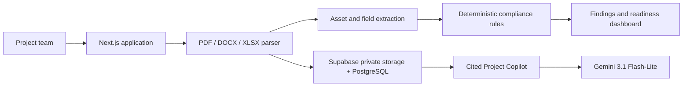

# 🛡️ SpecGuard

**Evidence-first compliance intelligence for data-centre EPC delivery.**

SpecGuard helps EPC teams identify specification deviations before equipment reaches site or delays commissioning. It compares approved client requirements with vendor submittals, preserves the original evidence, prioritises risk, and presents a clear readiness status for every critical asset.

The prototype ships with a complete synthetic project named **Orion DC-01**, covering UPS systems, CRAH/cooling equipment, and diesel generators.

## ⚠️ The problem

Data-centre EPC projects involve client specifications, BoQs, vendor data sheets, test records, and delivery commitments spread across disconnected documents. A mismatch such as a 400 kVA UPS being submitted against a 500 kVA requirement can reach site unnoticed and disrupt electrical energisation, commissioning, or Tier readiness.

SpecGuard turns that manual review workflow into an evidence-backed decision process:

1. Upload approved specifications and vendor documents.
2. Extract asset tags and technical fields.
3. Compare submitted values against deterministic compliance rules.
4. Display the mismatch, its source evidence, severity, project impact, and corrective action.
5. Track commissioning readiness from the highest unresolved issue per asset.

## ✨ Key functionality

- **📄 Document ingestion:** accepts text-based PDF, DOCX, and XLSX files up to 10 MB.
- **🔎 Structured extraction:** identifies equipment tags such as `UPS-01`, `CRAH-02`, and `DG-01`, plus capacity, voltage, redundancy, ingress protection, and lead-time fields.
- **✅ Deterministic compliance engine:** checks submitted values against configured rules; AI does not decide whether a field is compliant.
- **🔗 Evidence-backed findings:** every issue shows the approved requirement and vendor submission side by side, with document/page citations.
- **🚦 Risk and readiness passport:** marks assets as Ready, At Risk, Blocked, or Pending Review.
- **📌 Corrective-action workflow:** lets reviewers change a finding from Open to Under Review or Resolved.
- **💬 Project Copilot:** uses Gemini for cited questions over stored document chunks, with a safe deterministic fallback if the model is unavailable.
- **🔒 Persistent project data:** Supabase stores projects, private source documents, extracted chunks, assets, findings, and actions.

## 🎯 Demo scenario

The main demo asset is `UPS-01`:

| Approved requirement | Vendor submission | Result |
| --- | --- | --- |
| 500 kVA | 400 kVA | Critical deviation |
| 415 V | 400 V | Critical deviation |
| N+1 redundancy | N redundancy | Critical deviation |
| IP31 | IP20 | High deviation |
| 8-week delivery | 12-week delivery | High deviation |

SpecGuard blocks UPS-01 from commissioning release, cites the exact source evidence, and recommends a revised vendor submittal or approved alternative.

## 🧩 Architecture

## ⚙️ Tech stack

- **🖥️ Frontend / server:** Next.js, React, TypeScript, Tailwind CSS
- **📚 Document processing:** unpdf, Mammoth, SheetJS/XLSX
- **🤖 AI:** Gemini 3.1 Flash-Lite for extraction fallback and cited document Q&A
- **🗄️ Database and file storage:** Supabase PostgreSQL and private Storage bucket
- **☁️ Deployment target:** Vercel
